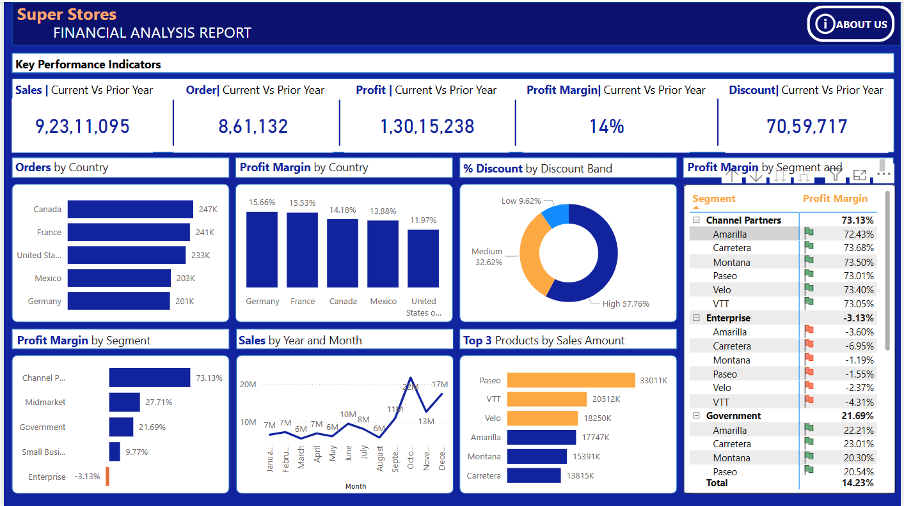

# 📊 Financial Analysis Dashboard

This Power BI dashboard presents a high-level financial analysis based on sales performance, profit trends, and geographic distribution.

## 📁 Folder Contents

- `Financial_Sample.xlsx` – Raw dataset
- `Financial_Analysis.pbix` – Power BI report
- `dashboard1.png` – Dashboard screenshot

## 🛠 Tools Used

- Power BI
- Microsoft Excel

## 🔍 Key Insights

- Top-performing regions by sales and profit
- Segment-wise profit contribution
- Trend of sales and profit over time
- Profit ratio by product category

## 📷 Dashboard Preview

