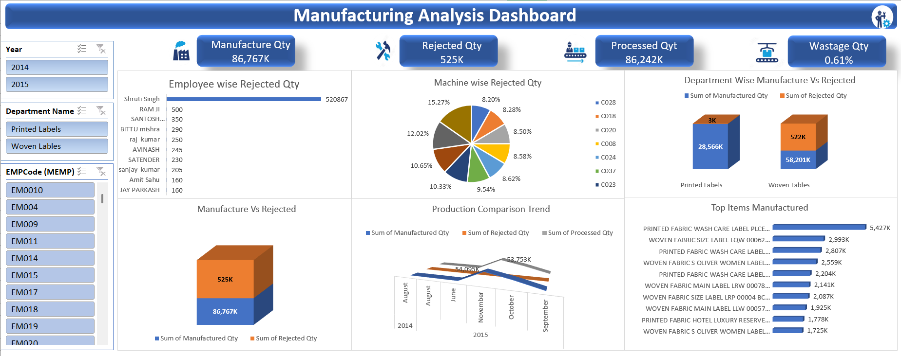
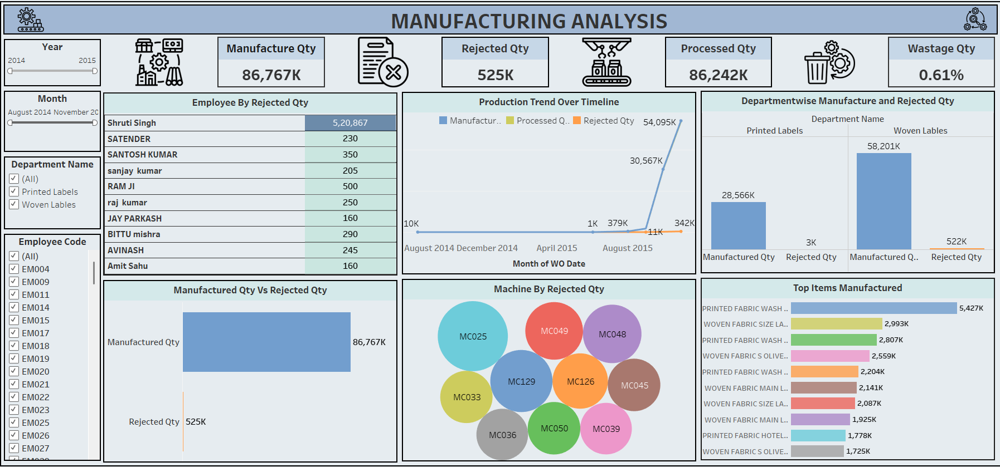
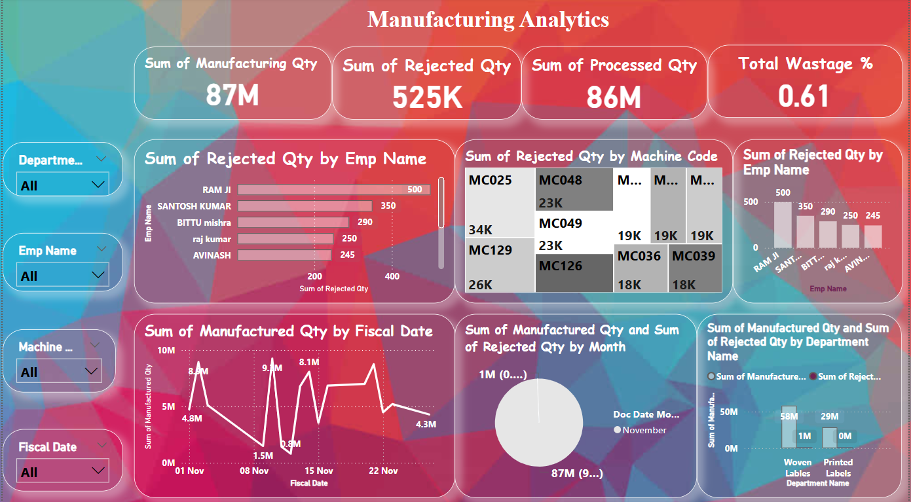

# 🏭 Manufacturing Analysis Dashboard  

## 📌 Project Overview  
This project focuses on analyzing **manufacturing data** to track production, rejection, wastage, and performance trends. The dataset consists of **large-scale production records** with key attributes such as:  

- **Year & Month** of production  
- **Department names**  
- **Employee codes & names**  
- **Machine codes**  
- **Manufactured quantity, rejected quantity, processed quantity, and wastage percentage**  

The goal was to build **interactive dashboards** that provide actionable insights into manufacturing efficiency, bottlenecks, and quality issues.  

---

## ✅ Key Objectives  
- Track **total manufactured, processed, rejected quantities** over time.  
- Identify **high rejection rates by employees, machines, and departments**.  
- Compare **manufactured vs. rejected quantities** for performance monitoring.  
- Visualize **production trends over months and years**.  
- Show **top items manufactured** with rejection details.  
- Highlight **wastage % trends** for quality improvement.  

---

## 🛠️ Tools & Technologies  
- **Excel** for data cleaning and transformation  
- **Power BI / Tableau** for dashboard creation  
- **Power Query** for ETL (Extract, Transform, Load)  
- **DAX calculations** for KPIs  
- **Interactive slicers & filters** for dynamic insights  

---

## 📊 Dashboards  

### 1️⃣ Manufacturing Analysis Dashboard  
  

### 2️⃣ Employee, Machine & Department-wise Rejection Analysis  
  

### 3️⃣ Advanced Manufacturing Analytics  
  

---

## 🔍 Insights & Outcomes  
✔ **86M+ units manufactured** with **525K rejected units**, resulting in a **0.61% wastage rate**  
✔ **Woven Labels department** had higher rejection compared to **Printed Labels**  
✔ Certain machines (**MC025, MC129, MC048**) contributed the most to rejection  
✔ **Employee-wise rejection trends** revealed key areas for quality improvement  
✔ Production trends showed **seasonal peaks** in certain months  

---

## 📖 What I Learned  
- Handling **large manufacturing datasets** with multiple dimensions  
- Building **hierarchical filters** (Year → Department → Employee/Machine)  
- Creating **dynamic KPIs** like rejection % and processed vs manufactured  
- Designing **clean & user-friendly dashboards** for operational insights  
- Understanding **real-world manufacturing KPIs**  

---

## ⚠️ Challenges Faced  
- **Data cleaning:** Inconsistent department & machine codes  
- **Date conversion issues:** Aligning fiscal dates with calendar dates  
- **Performance optimization:** Handling large datasets without lag in visuals  
- **Visualization choice:** Picking the right charts for operational metrics  
