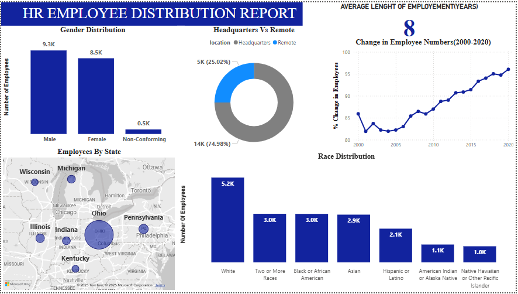
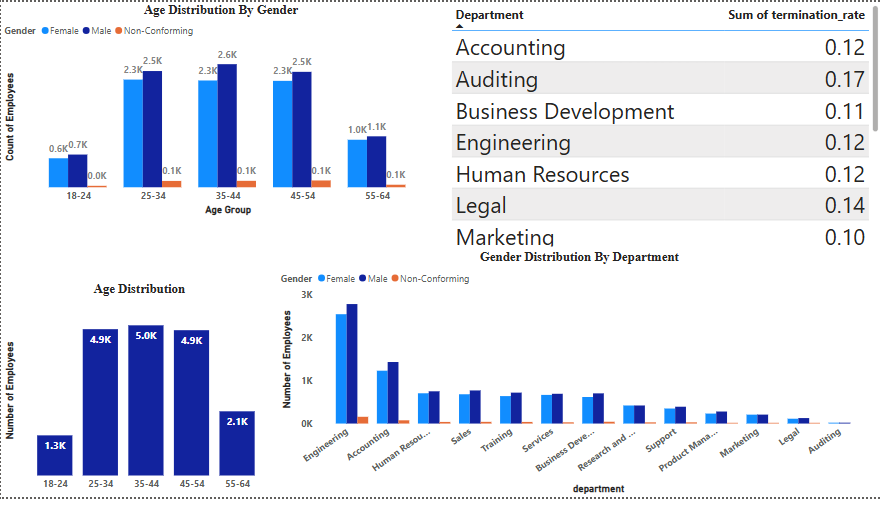

# 👥 HR Employee Distribution Report

This project presents an interactive HR analytics dashboard that visualizes employee demographics, distribution, and HR metrics to uncover key trends and insights about a company’s workforce.

> 📌 **Tools Used**: Microsoft Power BI | Excel | HR Dataset (mock data)  
> 🎓 **Project Level**: Beginner → Intermediate  
> 📅 **Developed While Learning Data Analysis Concepts**

---

## 📊 Key Insights

- **Gender Representation**: Male (9.3K), Female (8.5K), Non-conforming (0.5K)
- **Work Location**: 75% employees work remotely, 25% at HQ
- **Race Distribution**: Highest among White (5.2K), followed by Black or African American (3.0K)
- **Top States**: Pennsylvania, Ohio, and Illinois have highest employee count
- **Average Employment Length**: 8 years (from 2000–2020)
- **Departments with Highest Termination Rates**: Auditing (17%), Legal (14%)

---

## 📁 Dashboard Sections

| Section | Description |
|--------|-------------|
| 👨‍👩‍👧‍👦 Gender Distribution | Visual breakdown of male, female, and non-conforming employees |
| 🏠 Remote vs HQ | Donut chart showing location-based employee split |
| 🗺️ Employees by State | Map showing distribution across US states |
| 🧬 Race Diversity | Bar chart covering 7+ racial categories |
| 📈 Change Over Time | Line chart showing % change in employee count (2000–2020) |
| 👵 Age Group | Distribution by age & gender |
| 🏢 Departments | Termination rate + gender distribution by department |

---

## 🧠 What I Learned

- 📌 How to use **Power BI visualizations** effectively for HR analytics
- 📌 Applying **data transformation and cleaning** techniques in Excel
- 📌 Creating **interactive dashboards** with slicers, filters, and maps
- 📌 Understanding workforce KPIs like **termination rate**, **employment trends**, and **diversity distribution**
- 📌 Improved storytelling with visuals — from raw data to actionable HR insights

## 📊 Dashboard Preview

  

---

## 🚀 How to Use

1. Open the Power BI file (`HR_Employee_Distribution.pbix`)
2. Explore visuals using filters (age, gender, department, location)
3. Modify or extend visuals for practice or portfolio presentation

---

## 🧾 Project Credits

This project is built using mock HR data, purely for educational and practice purposes.

  
